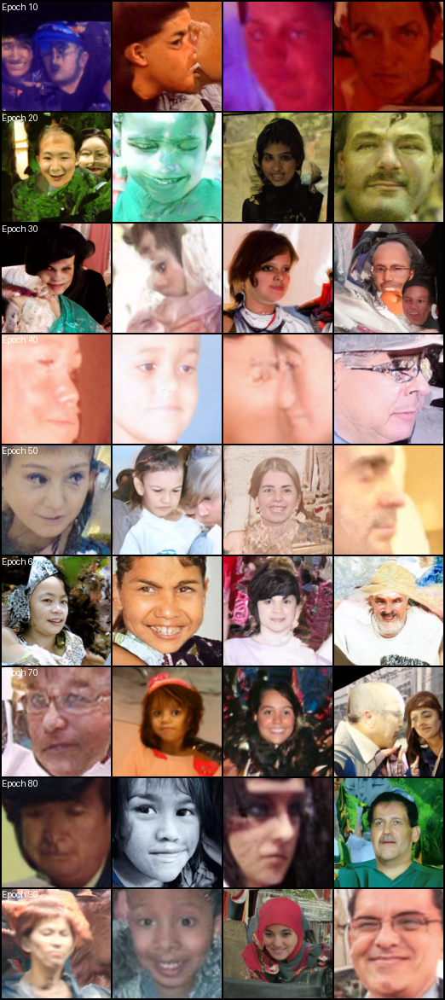

# 🧠 FairFace Conditioned Diffusion Model

This project trains a conditional diffusion model on the [FairFace](https://huggingface.co/datasets/HuggingFaceM4/FairFace) dataset using discrete attributes: **age**, **gender**, and **race**.

Each sample is conditioned on one of `9 × 2 × 7 = 126` unique combinations from the dataset's categorical metadata.

---

## 📊 Conditioning Setup

We compute a single integer condition ID from:

- **Age**: 9 classes
- **Gender**: 2 classes
- **Race**: 7 classes

The combined ID is:

```
condition_id = (age_id * 14) + (gender_id * 7) + race_id
```

Each condition is embedded with `nn.Embedding(126, 512)` and passed into a cross-attention UNet.

---

## 🏗️ Model Architecture

The model is a `UNet2DConditionModel` from 🤗 `diffusers`:

- **Input**: 3-channel RGB (128×128)
- **Cross-attention**: 512-dim from conditional embeddings
- **Scheduler**: DDPM with 1000 timesteps
- **Mixed precision**: Enabled via `torch.amp`

---

## 🖼️ Generated Samples by Epoch

Samples below show **4 different conditions** (0–3) generated from models trained for increasing epochs.

| Sample                              |
| ----------------------------------- |
|  |
|                                     |

---

## 🧪 Dataset Preparation

```python
from datasets import load_dataset, concatenate_datasets

# Load both 0.25 and 1.25 splits
dataset_025_train = load_dataset("HuggingFaceM4/FairFace", "0.25", split="train")
dataset_025_val   = load_dataset("HuggingFaceM4/FairFace", "0.25", split="validation")
dataset_125_train = load_dataset("HuggingFaceM4/FairFace", "1.25", split="train")
dataset_125_val   = load_dataset("HuggingFaceM4/FairFace", "1.25", split="validation")

# Merge all splits
merged_dataset = concatenate_datasets([
    dataset_025_train, dataset_025_val,
    dataset_125_train, dataset_125_val
])
```

---

## 🧬 Training Loop

```python
for images, cond_ids in dataloader:
    # Encode condition
    emb = cond_emb(cond_ids).unsqueeze(1)

    # Noise injection
    t = torch.randint(0, 1000, (images.size(0),), device=device)
    noise = torch.randn_like(images)
    noisy = scheduler.add_noise(images, noise, t)

    # Denoise
    pred = unet(noisy, t, encoder_hidden_states=emb).sample
    loss = F.mse_loss(pred, noise)

    # Backprop
    scaler.scale(loss).backward()
    scaler.step(optimizer)
    scaler.update()
```

Each epoch:

- Trains on \~200,000 images
- Saves a model checkpoint
- Generates and saves 3 sample images

---

## 💾 Checkpoint Structure

Trained models are saved as:

```
./models/unet_epoch_{EPOCH}.pt
```

Samples are saved as:

```
./models/sample_epoch_{EPOCH}_{i}.png
```

---

## 🧠 Sample Generation During Inference

```python
x = torch.randn(1, 3, size, size).to(device)

for t in reversed(range(1000)):
    t_tensor = torch.tensor([t], device=device)
    pred = unet(x, t_tensor, encoder_hidden_states=emb).sample
    x = scheduler.step(pred, t, x).prev_sample
```

These are used to produce a visual progression of model capability over time.

---

## ✅ Results Summary

- ✔️ Supports 126 discrete conditionings
- ⚡ Mixed-precision training with `torch.amp`
- 💾 Saved checkpoints and visual samples per epoch
- 📊 Structured dataset merging and label encoding

---

## 📁 Outputs

```bash
./models/
├── unet_epoch_10.pt
├── unet_epoch_20.pt
├── ...
├── sample_epoch_10_0.png
├── sample_epoch_10_1.png
├── ...
./assets/
└── grid_epochs_10_90.png
```

Here’s the **MIT License** section formatted in markdown, including a direct link to the full license text:

---

## 📄 License

This project is licensed under the MIT License - see the [LICENSE](LICENSE) file for details.
